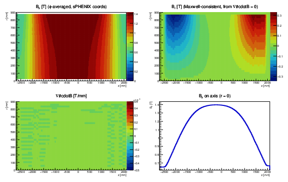
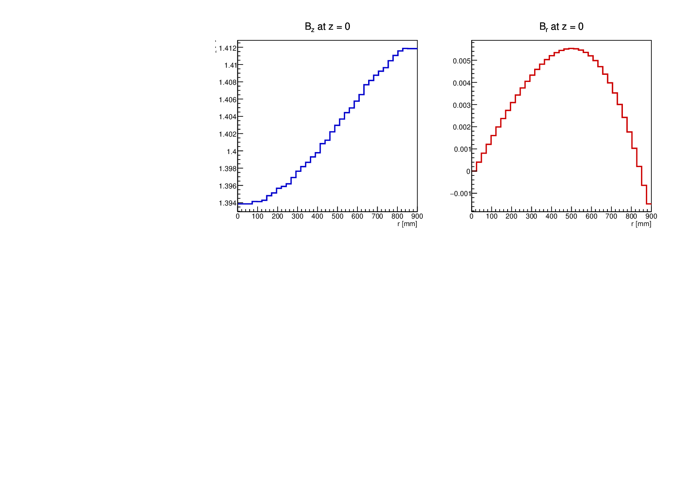
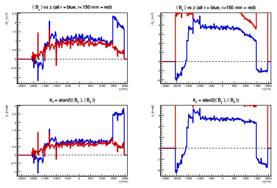

# sPHENIX Solenoid Field Map (CERN Final Mapping)

C++ ROOT class that reads the sPHENIX solenoid magnetic field measurement CSVs
(from the CERN final mapping campaign), averages the azimuthal measurements into
a regular (r, z) grid, and enforces ∇·B = 0 to produce a physically consistent
field map.

## Files

| File | Description |
|------|-------------|
| `sPHENIXFieldMap.h` | Class declaration |
| `sPHENIXFieldMap.cxx` | Implementation |
| `checkFieldMap.C` | ROOT diagnostic macro — plots and Maxwell check |
| `findCenter.C` | ROOT macro — finds the solenoid magnetic centre (Bz peak / Br zero crossing) |
| `checkAlignment.C` | ROOT macro — checks alignment of the solenoid axis with the sPHENIX z axis |

## Data files (not included)

The two full-field CSV files are required at run time but are not stored in this
repository due to their size (~43 MB combined).  On SDCC they are available inside:

```
/sphenix/data/data02/sphenix/MagnetMapping/cernfinal/download.tar
```

- `fieldMapFineFullField.csv` — 2 cm step, 10° azimuthal, ~200 k points
- `fieldMapRoughFullField.csv` — 10 cm step, 10° azimuthal, ~42 k points

Format (from `Readme.txt`):

```
x, y, z, |B|, Bx, By, Bz     [mm, T — surveyor coordinate system]
```

Surveyor → sPHENIX coordinate transform:
`x_phx = x_s`, `y_phx = z_s`, `z_phx = −y_s`;
`Bx_phx = Bx_s`, `By_phx = Bz_s`, `Bz_phx = −By_s`.

## Usage

Compile and run diagnostics from the directory containing the CSVs:

```bash
root -l -b -q 'sPHENIXFieldMap.cxx+' 'checkFieldMap.C'
```

Find the magnetic centre:

```bash
root -l -b -q 'sPHENIXFieldMap.cxx+' 'findCenter.C'
```

### In your own code

```cpp
#include "sPHENIXFieldMap.h"

sPHENIXFieldMap fmap("fieldMapFineFullField.csv",
                     "fieldMapRoughFullField.csv");

// Cylindrical sPHENIX coordinates
double Br, Bphi, Bz;
fmap.GetField(r_mm, phi_rad, z_mm, Br, Bphi, Bz);

// Cartesian sPHENIX coordinates
double Bx, By, Bz;
fmap.GetFieldXYZ(x_mm, y_mm, z_mm, Bx, By, Bz);
```

## Grid

| Parameter | Value |
|-----------|-------|
| r range | 0 – 900 mm, 25 mm step (37 nodes) |
| z range | −2700 – 2100 mm, 20 mm step (241 nodes) |
| Interpolation | Bilinear |
| Bφ | 0 (azimuthal symmetry enforced) |
| Br | Derived from ∇·B = 0: `Br(r,z) = −(1/r) ∫₀ʳ r′ ∂Bz/∂z dr′` |

## Results

On-axis field at origin: **Bz(0, 0, 0) ≈ 1.394 T**

Magnetic centre (Bz maximum / Br sign change): **z ≈ −240 mm**

∇·B residual over the full grid:

| Metric | Value |
|--------|-------|
| mean | −3.4 × 10⁻¹⁰ T/mm |
| RMS | 4.5 × 10⁻⁶ T/mm |
| \|max\| | 2.7 × 10⁻⁵ T/mm |

(Typical field-gradient scale ~3 × 10⁻⁴ T/mm, so the Maxwell residual is < 10%.)

### Field map overview



*Clockwise from top-left: Bz(r,z), Br(r,z), Bz on axis vs z, ∇·B(r,z).*

### Mid-plane slices (z = 0)



*Left: Bz vs r at z = 0. Right: Br vs r at z = 0.*

## Solenoid alignment

The φ-averaged transverse field components ⟨Bx⟩ and ⟨By⟩ are non-zero and nearly
constant over the full z range, indicating a rigid tilt of the solenoid axis
relative to the sPHENIX z axis:

| | Value |
|-|-------|
| θ_x | +0.79 mrad |
| θ_y | +2.26 mrad |
| \|θ\| total | **2.39 mrad (0.137°)** |
| Tilt azimuth | 71° (primarily toward sPHENIX +y) |

### Alignment plots



*φ-averaged transverse field and inferred tilt angles vs z. Blue: all r; red: r < 150 mm.
The flat profiles confirm a rigid tilt rather than a winding asymmetry.*

## Presentations

- [Presentation to tracking meeting 2026-04-28](magnet_mapping_haggerty_2026-04-28.pdf)
